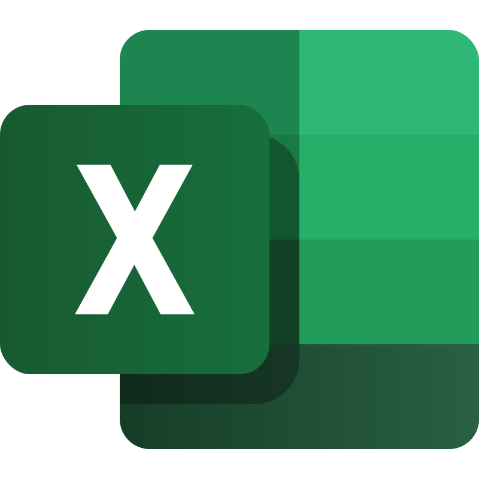
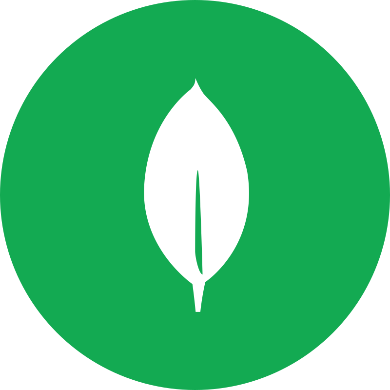

 

<h1 align="center">
 
 </a> Hello World !!!  
 </a>I'm Dexter, ...The Data Analyst...
</h1>

  
  
  
  
  
  
  
  
  
  
  

---

  

  I'm a **Data Analyst** passionate about turning raw data into actionable insights. With expertise in data visualization, statistical analysis, and predictive modeling, I help businesses make informed decisions.  

  🔭 **Currently Working On**: [**WalMart Dataset Project**](https://github.com/DexterCosmos/WalMart_DB)

  🌱 **Learning**: Exploring the world of **MongoDB** – diving deep into NoSQL databases and mastering data storage and retrieval.  

  💡 **Fun Fact**: "Life is useless, but coding makes it meaningful!" 😄  

  *Feel free to explore my projects, connect with me, or just say hello!*

---

### ‖ Languages & Technologies ‖ 

  
  
  
  
  
  
  
  
  
  

---

### 🔍 ‖ Git Stats ‖

---

### 💀 ‖ Github Contributions ‖

<picture>
  <source media="(prefers-color-scheme: dark)" srcset="https://raw.githubusercontent.com/DexterCosmos/DexterCosmos/output/github-snake-dark.svg" />
  <source media="(prefers-color-scheme: light)" srcset="https://raw.githubusercontent.com/DexterCosmos/DexterCosmos/output/github-snake.svg" />
  
</picture>

---

### 👀 ‖ Profile Views ‖

*P.S. I’m busy cooking up some cool future projects—stay tuned! ⚡*

    
  

---

### ☕ ‖ Buy Me A Coffee ‖

*If you appreciate my projects, buy me a cup of coffee!* ☕

---

  <b> ↓↓ Scroll Down for top projects ↓↓ </b>

